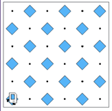

## Assignment
Warning: this is really hard to get perfect!

Get Karel to create a checkerboard pattern of beepers inside an empty rectangular world, as illustrated below:

Note: Karel should end up where she starts

As you think about how you will solve the problem, you should make sure that your solution works with checkerboards that are different in size from the standard 6x6 checkerboard shown in the example above. Some examples of such cases are discussed below. Odd-sized checkerboards are tricky, and you should make sure that your program generates the following pattern in a 5x3 world:

This problem is hard: Try simplifying your solution with decomposition. Can you checker a single row/column? Make the row/column work for different widths/heights? Once you've finished a single row/column, can you make Karel fill two? Three? All of them? Incrementally developing your program in stages helps break it down into simpler parts and is a wise strategy for attacking hard programming problems.