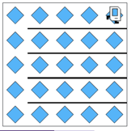
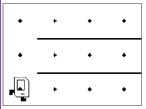
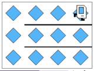

## Assignment
Your task is to help Karel fill the world with beepers, regardless of its size.

For example, consider Karel's starting 5x5 world. When complete it should look like this:

Note that Karel's final position does matter. Karel should be in the top-right corner facing right. You can assume that Karel always starts in the bottom-left corner, facing right. Your code needs to work on more than just a 5x5 world. For example if you run your solution on the 3x4 world

The result should still be a world filled with beepers:

Notice the walls! Each world will have similar walls, blocking Karel from moving up rows, except for on the first column. How can you fill the world without running into any of them? Hint: if you find this problem challenging, good, it is! Review Lesson 3: Decomposition.