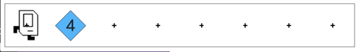
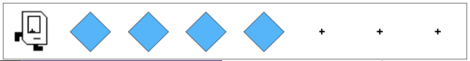

# Section 2: Karel Problem Solving

This week in section, your goal is to solve a Karel problem together using decomposition and stepwise refinement.

Here's the Link to the Section 2 Code!!

## Spread Beepers

In this task, Karel will always start by standing in front of a pile of beepers. Karel needs to pick up the entire pile of beepers and spread them out along the row so that there is exactly one beeper in each cell, and exactly as many cells with beepers as were in the original pile. The line of spread beepers should begin where the pile originated (which is on row 1 column 2).

Here is an example before and after:

Before:

After:

You may assume that:

- There is only one row in the world
- Karel starts with infinite beepers in her bag (how will you make sure to only spread as many beepers as were in the original pile?)
- The pile of beepers is on the second corner, directly in front of where Karel starts
- The world is wide enough for all the beepers, and there will be empty cells at the end of the row at the end

Write the code to implement Spread Beepers Karel. Come up with a strategy first. Think, "what are the high-level steps Karel needs to take?" and make these steps into helper functions. Remember that your program should work for a pile of any size.

Have extra time? Do one of these fun extensions!

Spread Multiple Rows of Beepers

Imagine instead of one row of beepers, there are multiple rows stacked on top of one another that we need to spread out!

Link to the IDE space for this problem

Repeat-a-Message

Have students write a Python program that takes in an input message from the user and repeats the message 10 times!
