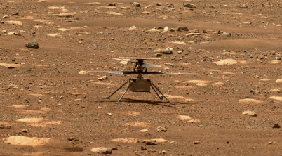

## Assignment

Mars Weight
A few years ago, NASA made history with the first controlled flight on another planet. Its latest Mars Rover, Perseverance, has onboard a 50cm high helicopter called Ingenuity. Ingenuity made its third flight, during which it flew faster and further than it had on any of its test flights on Earth. Interestingly, Ingenuity uses Python for some of its flight modeling software!

Ingenuity on the surface of Mars (source: NASA)

When programming Ingenuity, one of the things that NASA engineers need to account for is the fact that due to the weaker gravity on Mars, an Earthling's weight on Mars is 37.8% of their weight on Earth. Write a Python program that prompts an Earthling to enter their weight on Earth and prints their calculated weight on Mars. The output should be rounded to two decimal places when necessary. Python has a round function which can help you with this. You pass in the value to be rounded and the number of decimal places to use.

Sample Run

$ python marsweight.py
Enter a weight on Earth: 120
The equivalent weight on Mars: 45.36
