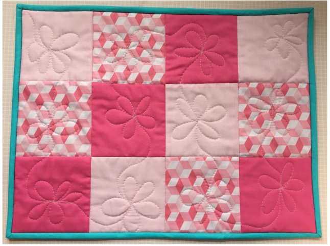
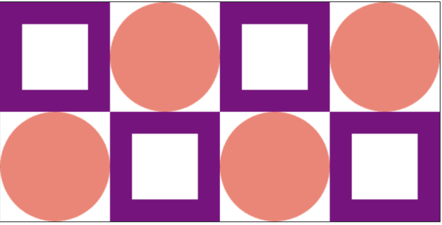
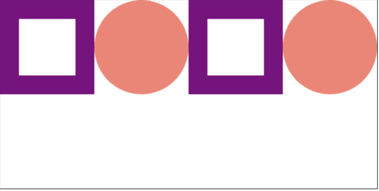

## Assignment

A quilt, as you may know, is a blanket often composed of repeating "patches". Here is a quilt in the real world:

Quilt with 12 patches. Patches are varying shades of pink and have different designs.

Your first objective is to recreate this quilt:

There are 12 shapes on the canvas. Purple rectangle with transparent outline starting at (0, 0) and ending at (100, 100). White rectangle with transparent outline starting at (20, 20) and ending at (80, 80). Salmon oval with transparent outline starting at (100, 0) and ending at (200, 100). Purple rectangle with transparent outline starting at (200, 0) and ending at (300, 100). White rectangle with transparent outline starting at (220, 20) and ending at (280, 80). Salmon oval with transparent outline starting at (300, 0) and ending at (400, 100). Salmon oval with transparent outline starting at (0, 100) and ending at (100, 200). Purple rectangle with transparent outline starting at (100, 100) and ending at (200, 200). White rectangle with transparent outline starting at (120, 120) and ending at (180, 180). Salmon oval with transparent outline starting at (200, 100) and ending at (300, 200). Purple rectangle with transparent outline starting at (300, 100) and ending at (400, 200). White rectangle with transparent outline starting at (320, 120) and ending at (380, 180).

Each patch has height and width of 100 pixels, given by the constant PATCH_SIZE. There are two different patch patterns that repeat in different locations.

In this assignment each patch will be defined by a function. For example consider the draw_square_patch function which is already implemented for you in the starter code:

def draw_square_patch(canvas, start_x, start_y): # draws a purple frame at (start_x, start_y)
...

draw_square_patch is passed three parameters,

canvas: the canvas upon which we are drawing

start_x: the left side of the patch is start_x pixels from the left side of the canvas

start_y: the top of the patch is start_y pixels from the top of the canvas

This function can be reused as many times as you like. For example main calls it with different values for start_x and start_y. Different style patches, like the circle patch will have their own functions, but will take in the same three parameters.

The starter code has two places marked TODO. Fill them in to solve the task. You will need to define the circle patch function and make all the necessary function calls in order to draw the second row.

# TODO: your code here

Milestone 1: Circle Patch
The draw_circle_patch function has not been implemented. Your first task is to complete the code in the body of draw_circle_patch. You should simply draw a circle that fills the patch at the provided location. The color for the circle in this demonstration is 'salmon'. Once you have implemented this function, your quilt should look like this:

There are 6 shapes on the canvas. Purple rectangle with transparent outline starting at (0, 0) and ending at (100, 100). White rectangle with transparent outline starting at (20, 20) and ending at (80, 80). Salmon oval with transparent outline starting at (100, 0) and ending at (200, 100). Purple rectangle with transparent outline starting at (200, 0) and ending at (300, 100). White rectangle with transparent outline starting at (220, 20) and ending at (280, 80). Salmon oval with transparent outline starting at (300, 0) and ending at (400, 100).

Milestone 2: Second Row
The main function currently creates four patches. Your next job is to add four more lines to main so that it draws the second row. Note that the start_y values should all be PATCH_SIZE because the second row is PATCH_SIZE pixels from the top of the canvas.

Milestone 3: Collaborate
When you are done, push the "Check Correct" button. Then, you can optionally participate in making a big and wonderful Code in Place quilt. Create the most interesting patch you can think of and share the function definition on the forum. Find patches you love and incorporate them into your quilt.

To keep everything standard, each patch function should all take the same three parameters (canvas, start_x, start_y). All patches should be designed and should all be 100 pixels wide by 100 pixels high.
